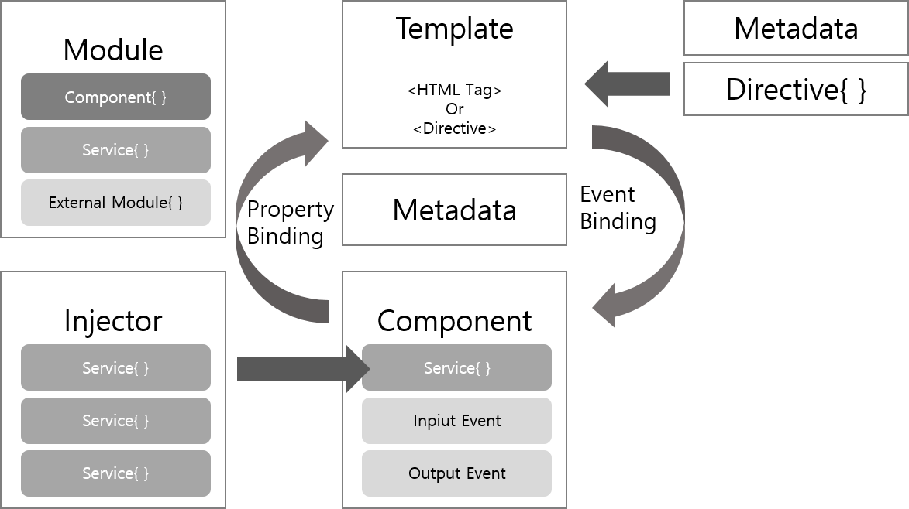

## ANGULAR 구조

### 개념  
Angular 는 크게 Component,Template,Directive,Service,Module이 존재한다.  
Angular 프로젝트를 생성하면 기본으로 만들어지는 모듈에는 app-routing.module.ts와 app.module.ts가 있으며,  
컴포넌트는 app.component.html, app.component.scss, app.component.ts, app.component.spec.ts가 있다.  

<br>

### 구성요소
1. NgModule(Module)
NgModule은 angular 에서 가장 중요한 구성요소로, 관련있는 다른 요소를 묶는 역할을 한다.  
사용할 컴포넌트나 서비스 프로바이더등이 포함될수있다.
모든 angular 프로젝트에는 반드시 하나 이상의 모듈이 존재 하며, 그중 AppModule(app.modules.ts)이 단하나의 최상의 모듈이다.


```javascript

import { NgModule } from '@angular/core';
import { BrowserModule } from '@angular/platform-browser';

import { AppRoutingModule } from './app-routing.module';
import { AppComponent } from './app.component';
import { HomeComponent } from './home/home.component';
import { CustComponent } from './cust/cust.component';
import { NotFoundComponent } from './not-found/not-found.component';
import { ChildAComponent } from './child/child-a/child-a.component';
import { ChildBComponent } from './child/child-b/child-b.component';

@NgModule({
  declarations: [
    AppComponent,
    HomeComponent,
    CustComponent,
    NotFoundComponent,
    ChildAComponent,
    ChildBComponent
  ],
  imports: [
    BrowserModule,
    AppRoutingModule // Angular CLI가 AppRoutingModule을 AppModule imports 배열에 자동으로 추가합니다.
  ],
  providers: [],
  bootstrap: [AppComponent]
})
export class AppModule { }
```
src/app/app.module.ts 구성  
Declarations: 해당 모듈에 포함될 구성요소(컴포넌트나 디렉티브 , 파이프)의 리스너를 선언  
Exports: 해당 모듈의 컴포넌트나 디렉티브를 다른 모듈에서 사용하고 싶을때 작성. AppModule(최상위모듈)에는 존재 하지 않는다.  
Imports: 외부 모듈(혹은 라이브러리)을 사용하고싶을떄 추가  
Proivders:모듈내에 생서된 서비브 프로바이더를 작성, injector가 서비스 존재 여부 확인 가능  
Bootstrap: 프로젝트 진입점으로 최상위 컴포넌트에만 작성한다.  

<br/>
2. Component  
AppComponent 구성파일
    * app.component.html : HTML 템플릿 파일
    * app.component.scss : scss 파일(기본은 CSS 파일)
    * App.component.ts : 컴포넌트 파일 (TypeScript)
    * app.component.specs.ts : 테스트 파일


```javascript
import { Component } from '@angular/core';

@Component({
  selector: 'app-root',
  templateUrl: './app.component.html',
  styleUrls: ['./app.component.css']
})
export class AppComponent {
  title = 'ANGULAR-TEST';
}
```
src/app/app.component.ts 구성  
Selector  : HTML 켐플릿의 이름이며, 예를들어 selector를 app-rootㄹ 선언한경우, 다른 템플렛에서 <app-root></app-root> 로 import 할수있다.  
templateUrl :  해당 컴포넌트의 HTML 템플릿과 매핑한다.  
styleUrls: 해당 컴포넌트의 스타일과 매핑한다.  
</br>

3. Service  
서비스는 어느 컴포넌트에서 사용할수있는 공통된 로직을 작성하며 (카카오톡상담 , 모달등), @injectable 데코레이터를 작성하여 데이터 공유클래스와 비즈니스로직으로 동시에 사용이 가능하다.


```javascript
@Injectable()
export class ExampleService{
  //...
}
```
</br>

4. Directive  
Angular가 제공하는 디렉티브는 크게 어트리뷰트 디렉티브와 구조디렉티브 로 나뉜다.  
디렉티브는 DOM의 모든것을 직접관리 할수있다. HTML 요소 또는 어트리뷰트의 형태로 사용하여 디렉티즈가 사용된 요소에게 지시 전달.  
디렉티브는 프로젝트 전역에서 사용할수있도록 공통관심사를 컴포넌트에서 분리한것이다.  
<br>
어트리뷰트 디렉티브  
- NgClass : CSS 클래스 추가 / 제거  
- NgStyle : HTML 스타일 추가 / 제거  
- NgModel :  HTML 폼요소에 양방향 데이터 바인딩 추가  
<br>
구조디렉티브  
- NgIf : 조건에따라 DOM에 추가 /제거  
- NgFor : 배열 항복에 따라 DOM 에 추가  
- NgSwitch : 조건에 맞는것을 선택해서 DOM 추가
<br>
```
#명령어 실행후 , 자동으로 app.module.ts에 import되며, declaratio에 추가됨
#warn-text.directive.spec.ts 와 warn-text.directive.ts 파일 생성 
$ng generate directive warnText
```
```javascript
#명령어 실행후 , 자동으로 app.module.ts에 import되며, declaration에 추가됨
$ng generate directive 파일명
```
<br/>

5. Pipe  
데이터를 원하는 형태로 변환, 출력데이터에 대해서 추가적인 처리를 한후에 화면에 출력할수있도록 하며, 화면에 표시하는 형식만 변경하고 싶을때 사용한다.  
기본적으로 앵귤러에서 제공하는 Built-in 파이프와 custom pipe 가있다.  
기본 제공하는 파이프  : https://angular.io/guide/pipes  
Built-in pipe 예제  
component에 사용할 변수
```javascript
import { Component, OnInit } from '@angular/core';

@Component({
  selector: 'app-child-a',
  templateUrl: './child-a.component.html',
  styleUrls: ['./child-a.component.css']
})


export class ChildAComponent implements OnInit {

  book={
    "title" : "Wallace and Grommit"
    ,"stock": 1234567891231
    ,"star" : 4.2356265656
    ,"price":12000
    ,"publicDate" :new Date()
  }

  ngOnInit(): void {
  }

}
```
html 파일에서 ts 파일에 선언된 변수 파이프를 통해 사용
```HTML
<p>LIBRARY</p>
<div>title : {{book.title}}</div>
<div>stock : {{book.stock | number}}</div>
<div>star : {{book.star | number:'1.3-3'}}</div>
<div>price : {{book.price | currency:'KRW'}}</div>
<div>publicDate : {{book.publicDate| date:'y년 MM월 dd일'}}</div>
```
