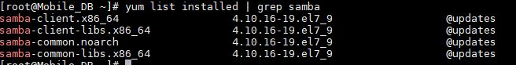
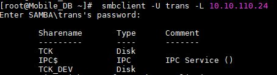
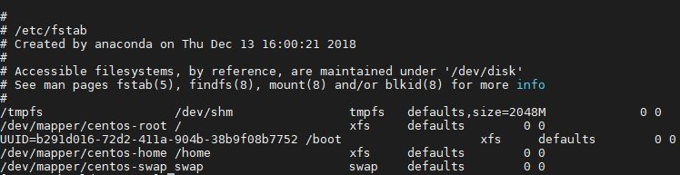
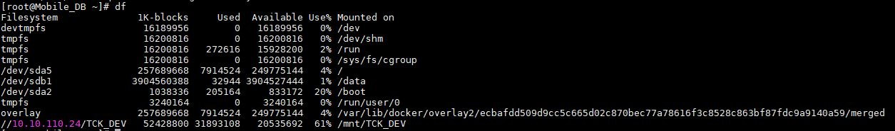
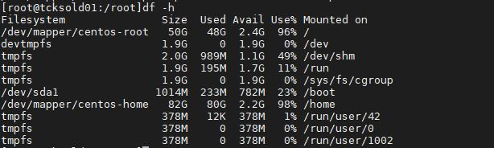

### NAS 서버의 이해
Network Attached Storage 의 약어로 파일을 저장하고 편리하게 이동하기 위해 만들어진 장치.

한장소에 NAS 하드웨어 장치를 두고 네트워크 연결을 통해 언제 어디서 눵하는 파일에접근하거나 공유할수 있도록 만드러짐. (네크워크서비스와 하드웨너 장치 전체를 범주에 두고 NAS 라고 한다.) 
###  MOUNT의 이해
실제공간인 디스크를 사용하기 위해 사용되는 운영 체제에 연결하는것 장치와 파일을 연결 (디스크 공간과 디렉토리를 연결 하는것)

EXAMPLE
USB 사용시 USB 파일이 자동으로 뜨며 연결된다 이는 윈도우에서 자동으로 마운트하여 일어나는 현상이다.

#### SMB의 이해
SMB(server message block)은 윈도우 시스템이 다른 시스템의 디스크등 자원을 공유 할수있도록 개발된 심바의 핵심 프로토콜

#### 마운트 사용시 주의 사항
한개의 장치에는 한개의 마운트 만을 사용(1:1)
마운트 포인트는 임의의 디렉토리여야함
반드시 포맷(파일시스템 생성)후 사용
마운트 해제시 , 마운트 포인트 이외의 디렉토리에서 해야한다.
마운트 할경우 마운트 포인터의 기존 내용을 덮어버리게 된다.(지워지지는않는다)
사용자 및 시스템 관련된 디렉토리를 마운ㅌ 포인트로 지정해서는 절대 안된다.
마운트시 작업할대상은 반드시 파티션(primary,logical)만 가능, 하드디스크와 확장파티션(extend)는 작ㄹ업대상이 될수없다.

#### 마운트 사용을 위한 과정
1. 디스크 추가
2. 디스크 파티션 분할 (사용할 시스템에 맞춰서 파일 시스템 타입 정하기)
3. 용도에 맞게 파일 시스템 포맷
4. 디스크를 마운트할 마운트 포인트 (디렉토리)를 만들어 놓아야 함(파일은 불가능, 디렉토리만 가능)

#### 마운트 사용을 위한 정보

1. 사용자명
2. 패스워드
3. 마운트할 서버주소
4. 공유 폴더
5. 마운트 경로

#### SMB를 통한 정보 취득
SMB를 통해 공유 폴더에 대한 정보 취득  
1. smbClient 설치 유무 확인
yum list installed | grep samba
smbclient -V
2. samba 설치후 유뮤 확인 (samba-client , samba-common 이 설치 되어있어야한다.)
yum install samba-client  
또는  
yum install samba  
[그림1]
 
  

3. smbclient를 이용하여 서버 공유 폴더 확인
smbclient -L IP번호   
-> 비밀번호 입력  

[그림2] 결과
  

#### NAS 서버를 연결 하기 위한 명령어
1. 마운트 패키지 설치 확인  
yum list installed | grep cifs-utils  
2. 마운트 패키지 설치 - mount하고자 하는 서버에 cifs를 설치한다.
#yum install cifs-utils
3. NAS와 연결(마운트)랑 디렉토리 생성
#sudo mkdir '마운트할 디렉토리명'
4. 일시적인 연결방법 - mount
#mount -t cifs -o user='사용자명',password='암호'//서버주소/공유폴더경로 /마운트경로
smb 버전을 지정하여 설정 하는 방법
#mount -t cifs -o user='사용자명',password='암호',vers=2.0 //서버주소/공유폴더경로 /마운트경로 

5. 영구적인 연결 방법 - fstab 편집
/etc/fstab은 파일시스템 정보를 저장하고있으며, 리눅스 부팅시 마운트 정보를 저장하며 , 부팅시 자동으로 적용 될수있도록 한다
#vi /etc/fstab
IP/공유폴더명 /마운트할 디렉토리명 cifs user='ID',pass='비번',vers1=1.0 또는 vers=2.0
10.10.110.24/TCK_DEV /mnt/TCK_DEV cifs user='trans' ,pass='tckdm_0000' 0 0 추가

fstab 편집 참고

[그림2]

 
1. file system - 파일 시스템의 장치명을 설치하는 부분 사용할 disk uuid, 원격IP/디렉토리명  
2. mount point - 파일 시스템장치를 마운트 시킬 위치를 설정 , 물리적인 디스크를 디렉토리에 연결하기 위한 설정  
[그림2] 에 마지막줄을 예를들어 /dev/mapper/centos-swap 이라는 하드디스크의 파티션 부분이있는데  이장치를 swap 이라는 디렉토리에 마운트 시키라는 의미  
3. type - 파일 시스템 종류,  파티션 생성시 정한 파일 시스템 종류 입력  
4. options - 파일 시스템에 맞게 옵션 설정  
(중요) 아이디와 비번은 별도의 증명 파일로 대체가능  
사용이유 : commend 라인에서 직접적으로 표시되는게 아니라 변수 형태로 입력되기 떄문에 유출 가능성이 낮아짐  
사용자홈 , 관리자홈 등 어디엔가 파일 생성  
$ vim credentails (파일명은 자유)  
username=ID  
password= 비밀번호  
저장
fstab 에서 username, password 대신에 credentails=/만드경로/credentials dlqfur  
5. dump - 백업 설정 (0: 지원안함 , 1: 지원)  
6. pass - file sequence check option  
fsck 에 의한 무결성 검사 우선순위  10.10.110.i10.10: 무결성 검사 하지않음  
1: 우선순위 1위(대부분 root가 설정됨)  
2: 우선순의가 2위  
//IP/디렉토리명-/마운트할 디렉토리명-cifs-rw,user,auto,file_mode=0600,dir_mode=0700,uid='USERID',gid=root,username='ID',password='비번'-0-0  

6. mount 확인
df
[그림3]

 
  
